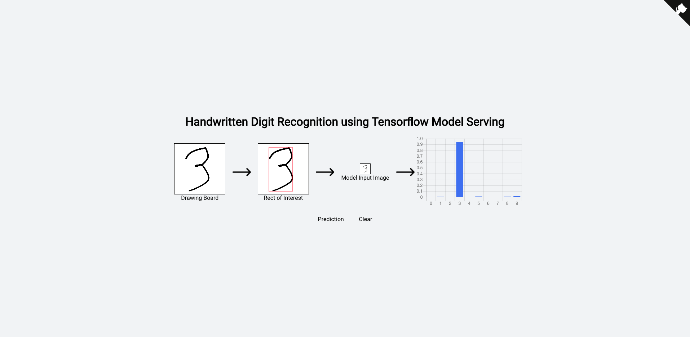

# Handwritten Digit Recognition
* Simple Tensorflow Serving Example

## Tech Stack
* ReactJS
  * typescript
  * Redux
  * Redux Saga
* Tensorflow
  * MLP
  * tensorflow model serving api
* Docker
  * Docker Compose
* Nginx

## UI

## Architectures

## Run
>> docker-compose up --build

## References
* https://www.tensorflow.org/tfx/serving/docker
* https://codepen.io/leer83/pen/ydgrZe